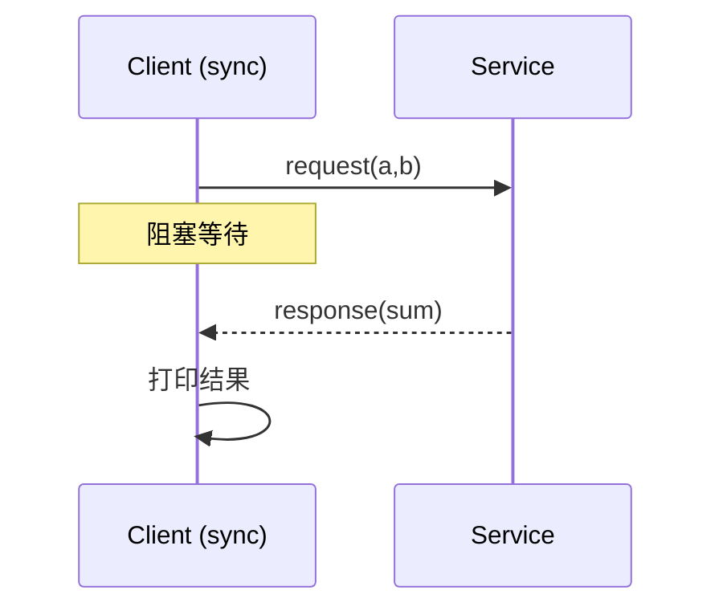
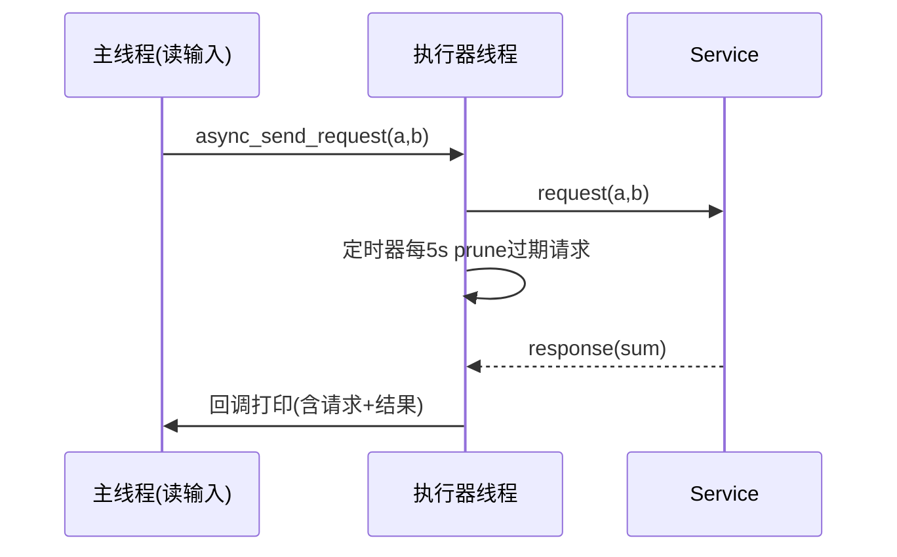

# minimal\_service — ROS 2 rclcpp 最小服务/客户端示例

该包提供 **AddTwoInts**（`example_interfaces/srv/AddTwoInts`）的最小可运行服务端与两种风格的客户端：

* **`minimal_service.cpp`**：服务端，实现 `/add_two_ints` 加法服务。
* **`minimal_client.cpp`**：**同步**客户端，请求一次，等待一次结果。
* **`async_client.cpp`**：**异步**客户端，边读用户输入边并发发送请求，不阻塞等待结果；内置超时清理逻辑。

---

## 目录结构

```
├── CMakeLists.txt
├── include
│   └── minimal_service
├── package.xml
└── src
    ├── async_client.cpp
    ├── minimal_client.cpp
    └── minimal_service.cpp
```

---

## 1. 快速开始

### 1.1 依赖

* ROS 2（建议 Humble 及以上）
* `rclcpp`, `example_interfaces`

### 1.2 编译

```bash
colcon build --packages-select minimal_service
source install/setup.bash
```

> 不确定可执行名？先查看：
>
> ```bash
> ros2 pkg executables minimal_service
> ```

### 1.3 运行（示例流程）

1. 启动服务端（可执行名以实际构建为准，这里仅作示例）：

```bash
ros2 run minimal_service add_two_ints_server
# 或：ros2 run minimal_service minimal_service
```

2. 启动**同步**客户端（一次请求一次响应）：

```bash
ros2 run minimal_service add_two_ints_client
# 或：ros2 run minimal_service minimal_client
```

3. 启动**异步**客户端（交互式、可并发挂起多个请求）：

```bash
ros2 run minimal_service add_two_ints_async_client
# 或：ros2 run minimal_service async_client
```

4. 亦可直接用命令行请求：

```bash
ros2 service call /add_two_ints example_interfaces/srv/AddTwoInts "{a: 1, b: 2}"
```

---

## 2. 三个示例的要点与差异

### 2.1 `minimal_service.cpp`（服务端）

* 创建 `rclcpp::Node`，注册 `create_service<AddTwoInts>("add_two_ints", cb)`。
* 回调中读取 `a`、`b`，计算 `sum` 并返回。
* 默认 QoS 满足本示例；如有实时负载或跨主机场景，再考虑线程与执行器的优化。

### 2.2 `minimal_client.cpp`（同步客户端）

* `client->wait_for_service()` 等待服务出现。
* `client->async_send_request()` + `rclcpp::spin_until_future_complete()` **同步等待结果**。
* 简单直观，**但每次请求都会阻塞当前线程**，不适合需要高吞吐的交互式输入。

### 2.3 `async_client.cpp`（异步客户端 — 本包亮点）

* 通过 `async_send_request(request, response_cb)` **立即返回**，不阻塞输入线程。
* **独立执行器线程** 处理 ROS 回调：

  ```cpp
  std::thread t([stop=node_promise.get_future(), node]() {
    rclcpp::executors::SingleThreadedExecutor ex; ex.add_node(node);
    ex.spin_until_future_complete(stop);
  });
  ```
* 使用 `SharedFutureWithRequest`，响应回调可同时拿到**原始请求+响应**，便于配对日志：

  ```cpp
  using Fut = rclcpp::Client<AddTwoInts>::SharedFutureWithRequest;
  auto cb = [logger](Fut f){ auto pr = f.get(); /* pr.first: req, pr.second: resp */ };
  ```
* **5s 周期 wall timer** + `prune_requests_older_than(now-5s)`：

  * 若服务端迟迟不回，**丢弃超时请求**并打印其请求号，避免无上限堆积。
  * 对交互式/高频输入非常实用（应用层 backpressure）。
* 主线程专注读取用户输入（支持输入 `q` 退出），交互更流畅。

> 设计好处：**不阻塞**、**可并发**、**可控清理**、**日志可追溯**（请求与响应一一对应）。

---

## 3. 交互演示（异步客户端）

* 启动服务端 → 启动异步客户端。
* 终端提示：输入第一/第二个数字（或 `q` 退出）。
* 你可以迅速输入多组数字；服务端处理完后，客户端会**陆续打印**每笔的结果：

```
Sending a request to the server (request_id=42) ...
Result of 100 + 23 is: 123
```

* 服务端长时间无响应时，客户端会打印：

```
The server hasn't replied for more than 5s, 2 requests were discarded, the discarded requests numbers are:
        41
        42
```

---

## 4. 常见问题（FAQ）

* **客户端一直显示 waiting for service？**

  * 服务端未启动或服务名不匹配（本示例用 `/add_two_ints`）。
  * 检查：`ros2 service list | grep add_two_ints`
* **异步客户端有时收到结果乱序？**

  * 正常现象：并发请求的完成顺序不保证；使用 `SharedFutureWithRequest` 打印可知每笔对应的 `a、b`。
* **请求越积越多内存上涨？**

  * 使用 `prune_requests_older_than` 的清理逻辑能缓解；也可改为“超时后提示用户重新输入”。
* **输入非法字符导致异常？**

  * 示例中建议对 `std::stoll` 增加 `try/catch` 与范围校验（如果你做了进一步改造）。

---

## 5. 顺序图（Sync / Async 对比）

### 同步客户端



### 异步客户端



---

## 6. 小贴士与改进建议

* 将 **5s 超时** 抽成参数（声明参数或命令行）以便调优。
* 交互程序建议统一使用 `RCLCPP_*` 日志；`setvbuf(stdout, _IONBF)` 可有可无。
* 若还需整合定时器/话题订阅等，考虑 **回调组 + 多线程执行器** 提升并发性。

---

**License**：与仓库一致（见根目录 LICENSE）。
**维护者**：请在 `package.xml` 中维护 `<maintainer>` 信息。
