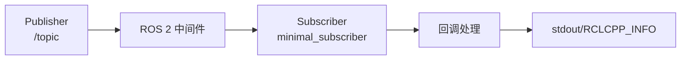

# minimal\_subscriber — ROS 2 rclcpp 最小订阅者示例

该包展示了多种 **接收消息** 的写法：C++11 lambda、成员函数回调、Topic Statistics（话题统计）、Type Adapter（类型适配）、内容过滤（Content Filtering），以及基于 `rclcpp::WaitSet` / `StaticWaitSet` / 定时触发 Wait-Set 的“拉取式”等待模型；并附带一个 **不推荐** 的非可组合风格示例，方便快速对比学习。

```
.
├── CMakeLists.txt
├── include
│   └── minimal_subscriber/
├── package.xml
└── src
    ├── content_filtering.cpp                        # 内容过滤订阅
    ├── lambda.cpp                                   # 定时器 + lambda 回调
    ├── member_function.cpp                          # 成员函数回调
    ├── member_function_with_topic_statistics.cpp    # 订阅端 Topic Statistics
    ├── member_function_with_type_adapter.cpp        # 订阅端 Type Adapter
    ├── member_function_with_unique_network_flow_endpoints.cpp # 唯一网络流端点
    ├── not_composable.cpp                           # 非可组合风格（不推荐）
    ├── static_wait_set_subscriber.cpp               # StaticWaitSet 等待模型
    ├── time_triggered_wait_set_subscriber.cpp       # WaitSet + Timer 触发
    └── wait_set_subscriber.cpp                      # WaitSet 等待模型
```

---

## 1. 快速开始

### 1.1 依赖

* ROS 2（建议 Humble 及以上）
* `rclcpp`, `std_msgs`

### 1.2 编译

```bash
colcon build --packages-select minimal_subscriber
source install/setup.bash
```

> 不确定可执行名？先看：
>
> ```bash
> ros2 pkg executables minimal_subscriber
> ```

### 1.3 运行与验证

准备一个发布源（任选其一）：

```bash
# 1) 用命令行发布 5Hz 文本
ros2 topic pub /topic std_msgs/String '{data: "hello"}' -r 5

# 2) 或运行你的 minimal_publisher 示例
# ros2 run minimal_publisher talker_timer_lambda
```

然后启动订阅者（示例，可执行名以实际构建为准）：

```bash
ros2 run minimal_subscriber listener_lambda
# 或
ros2 run minimal_subscriber listener_member_function
```

---

## 2. 示例速查表

| 源文件                                                      | 关注点                               | 适用场景              | 备注       |
| -------------------------------------------------------- | --------------------------------- | ----------------- | -------- |
| `lambda.cpp`                                             | `create_subscription` + lambda 回调 | 最少样板代码，快速起步       | 简洁直观     |
| `member_function.cpp`                                    | 成员函数回调                            | 工程化风格             | 便于扩展与单测  |
| `member_function_with_type_adapter.cpp`                  | Type Adapter                      | 内部自定义类型 ←→ ROS 消息 | 见 §3.3   |
| `member_function_with_topic_statistics.cpp`              | Topic Statistics                  | 延迟、周期等统计上报        | 见 §3.2   |
| `member_function_with_unique_network_flow_endpoints.cpp` | 唯一网络流端点                           | 网络抓包/QoS 监控       | 见 §3.4   |
| `content_filtering.cpp`                                  | 内容过滤订阅                            | 仅接收匹配消息，减少带宽与负担   | 见 §3.1   |
| `wait_set_subscriber.cpp`                                | WaitSet                           | 手动等待/掌控回调顺序/超时控制  | 见 §3.5   |
| `static_wait_set_subscriber.cpp`                         | StaticWaitSet                     | 编译期固定容量、零分配       | 见 §3.5   |
| `time_triggered_wait_set_subscriber.cpp`                 | WaitSet + Timer                   | 以时间片轮询，统一调度       | 见 §3.5   |
| `not_composable.cpp`                                     | 直接实例化 `rclcpp::Node`              | Demo/一次性脚本        | 不推荐，难组件化 |

---

## 3. 关键点讲解

### 3.1 内容过滤订阅（Content Filtering）

**用途**：让 DDS/中间件在网络层仅转发满足条件的样本，减少带宽与 CPU。适用于高频话题或选择性处理。

**基本用法要点**：

```cpp
rclcpp::SubscriptionOptions options;
options.content_filter_options.filter_expression = "data LIKE 'hello%'"; // SQL92-like 表达式（各 RMW 支持度不同）
options.content_filter_options.expression_parameters = {}; // 可选参数列表

sub_ = this->create_subscription<std_msgs::msg::String>(
  "/topic", 10,
  [this](std_msgs::msg::String::ConstSharedPtr msg){ /* ... */ },
  options);

// 运行期动态调整（若 RMW 支持）：
// sub_->set_content_filter(expression, parameters);
// sub_->reset_content_filter();
```

**提示**：表达式语法与支持能力依赖具体 RMW（Fast DDS、Cyclone DDS 等），不支持时会降级为普通订阅或报错。

---

### 3.2 订阅端 Topic Statistics（话题统计）

**用途**：周期性发布统计消息（如消息间隔、延迟等），便于监控/调优。你可在订阅选项里启用：

```cpp
#include <rclcpp/topic_statistics/subscription_topic_statistics.hpp>

rclcpp::SubscriptionOptions options;
options.topic_stats_options.state = rclcpp::TopicStatisticsState::Enable;   // 开启统计
// 可选：自定义统计发布话题与周期
options.topic_stats_options.publish_topic = std::string("/statistics");
options.topic_stats_options.publish_period = std::chrono::seconds(10);

auto sub = this->create_subscription<std_msgs::msg::String>(
  "/topic", 10,
  cb,
  options);
```

**注意**：

* 要想统计**端到端延迟**，消息内应包含带时钟的时间戳字段（例如 `builtin_interfaces/msg/Time`），示例中常用 `Header.stamp`。
* 统计的具体维度以 rclcpp 版本为准；默认周期与话题名可自定义。

---

### 3.3 订阅端 Type Adapter（类型适配）

**用途**：当回调中想直接拿到**业务内部类型**而不是 ROS 消息类型时，使用 `TypeAdapter` 进行透明转换。

```cpp
struct StringAdapter : rclcpp::TypeAdapter<std::string, std_msgs::msg::String> {
  static void convert_to_custom(const std_msgs::msg::String & in, std::string & out) { out = in.data; }
  static void convert_to_ros_message(const std::string & in, std_msgs::msg::String & out) { out.data = in; }
};

using Adapted = rclcpp::TypeAdapter<std::string, std_msgs::msg::String>;

auto sub = this->create_subscription<Adapted>(
  "/topic", 10,
  [this](const std::string & text){ /* 直接使用 std::string */ });
```

---

### 3.4 唯一网络流端点（Unique Network Flow Endpoints）

**用途**：请求订阅端使用**唯一的网络流端点**，便于抓包与流量区分。

```cpp
rclcpp::SubscriptionOptions options;
options.require_unique_network_flow_endpoints = RMW_UNIQUE_NETWORK_FLOW_ENDPOINTS_OPTIONALLY_REQUIRED;
// 也可设为 STRICTLY_REQUIRED / NOT_REQUIRED / SYSTEM_DEFAULT
```

**说明**：不同 RMW 的支持度不一；设为“严格需要”而不被支持时会报错，设为“可选”则优雅降级。

---

### 3.5 Wait-Set 等待模型

**用途**：在**不 spin** 的情况下显式等待若干实体（订阅、定时器、服务等）就绪；适合自定义调度、精确控制回调顺序、统一超时管理或与非 ROS 事件源整合。

**基本思路（伪代码）**：

```cpp
rclcpp::WaitSet waitset; // 或预分配的 rclcpp::StaticWaitSet
waitset.add_subscription(sub_);           // 注册
// waitset.add_timer(timer_); ...

while (rclcpp::ok()) {
  auto result = waitset.wait(std::chrono::milliseconds(200)); // 等待就绪或超时
  if (result.kind() == rclcpp::WaitResultKind::Ready) {
    // 逐个处理就绪的 handles（取消息、调用回调等）
  }
}
```

* `StaticWaitSet` 在编译期固定容量，避免运行期分配，更可控。
* `time_triggered_wait_set_subscriber.cpp` 通过 **Timer** 统一触发轮询节奏，便于构建时间片调度器。

---

## 4. 推荐用法与风格

* 常规应用优先使用 **Node 子类 + 成员函数回调**（`member_function.cpp`）。
* **内容过滤** 在高频话题、大带宽场景显著减少处理压力；优先选用。
* 需要监控与可视化时，开启 **Topic Statistics**，并保证消息含时间戳。
* 对回调入参的类型有自定义需求时，使用 **Type Adapter**。
* 只有在确需**自定义调度/严格时序**时使用 **Wait-Set**。

---

## 5. 运行示例（参考命令）

> 实际可执行名以 `ros2 pkg executables minimal_subscriber` 输出为准。

```bash
# 1) Lambda 回调
ros2 run minimal_subscriber listener_lambda

# 2) 成员函数回调
ros2 run minimal_subscriber listener_member_function

# 3) 内容过滤
ros2 run minimal_subscriber listener_content_filtering

# 4) Topic Statistics（订阅端统计）
ros2 run minimal_subscriber listener_member_function_with_topic_statistics

# 5) Type Adapter
ros2 run minimal_subscriber listener_member_function_with_type_adapter

# 6) 唯一网络流端点
ros2 run minimal_subscriber listener_member_function_with_unique_network_flow_endpoints

# 7) Wait-Set
ros2 run minimal_subscriber wait_set_subscriber
ros2 run minimal_subscriber static_wait_set_subscriber
ros2 run minimal_subscriber time_triggered_wait_set_subscriber

# 8) 非可组合（不推荐）
ros2 run minimal_subscriber listener_not_composable
```

配套观察：

```bash
ros2 topic info /topic -v
ros2 topic echo /statistics   # 若启用 Topic Statistics 并指定为该话题
```

---

## 6. 一个超简订阅者模板

```cpp
#include <rclcpp/rclcpp.hpp>
#include <std_msgs/msg/string.hpp>

class MinimalListener : public rclcpp::Node {
public:
  MinimalListener() : Node("minimal_subscriber") {
    rclcpp::SubscriptionOptions opts;
    // 示例：开启订阅端话题统计
    // opts.topic_stats_options.state = rclcpp::TopicStatisticsState::Enable;
    // opts.topic_stats_options.publish_topic = "/statistics";

    sub_ = create_subscription<std_msgs::msg::String>(
      "/topic", 10,
      [this](std_msgs::msg::String::ConstSharedPtr msg){
        RCLCPP_INFO(this->get_logger(), "I heard: '%s'", msg->data.c_str());
      },
      opts);
  }
private:
  rclcpp::Subscription<std_msgs::msg::String>::SharedPtr sub_;
};

int main(int argc, char ** argv) {
  rclcpp::init(argc, argv);
  rclcpp::spin(std::make_shared<MinimalListener>());
  rclcpp::shutdown();
  return 0;
}
```

---

## 7. 数据流简图



---

## 8. 常见问题（FAQ）

* **订阅不到消息？**

  * 确认话题名一致（本示例为 `/topic`）。
  * 检查 QoS 兼容性（可靠 vs 尽力而为、深度、历史等）。
  * 使用 `ros2 topic info -v /topic` 查看匹配详情。
* **Topic Statistics 无数据？**

  * 是否启用 `TopicStatisticsState::Enable`；统计发布话题是否被订阅/可见。
  * 是否有可用时间戳字段用于延迟估计（例如 `Header.stamp`）。
* **内容过滤不生效？**

  * 关注 RMW 的支持情况与表达式语法；必要时回退为普通订阅。
* **Wait-Set 阻塞或空转？**

  * 检查等待超时设置与实体是否正确添加到 Wait-Set；避免与 `spin()` 并用造成竞争。

---

## 9. 相关建议

* 与发布者示例搭配使用，便于端到端调试（参见 `minimal_publisher`）。
* 需要组件化与进程内组合时，避免 `not_composable.cpp` 的写法；改用可组合节点并在 `component_container_mt` 运行。

---

**License**：与本仓库整体一致（见仓库根目录 LICENSE）。
**维护者**：请在 `package.xml` 中的 \`\<maintainer
